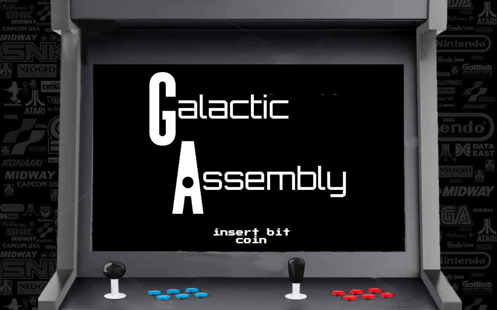
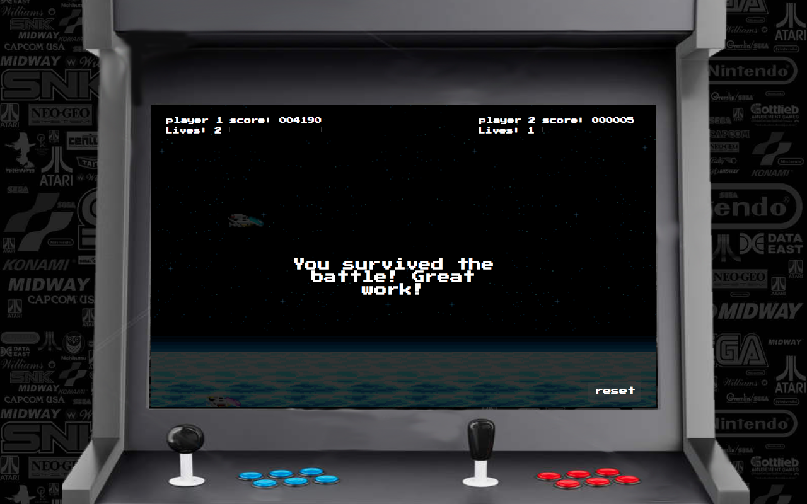

# Galactic Assembly Arcade Game

[Play the Galactic Assembly Arcade Game on GitHub Pages](https://curtisburns.github.io/wdi-project-one/)

[View the Galactic Assembly Arcade Game on GitHub](https://github.com/curtisburns/wdi-project-one)

# Game instructions

You are a member of the Galactic Assembly, a collective brought together to deal
with the imbalance that injustice brings to the galaxy and wider universe. As a
pilot, you are entrusted with the impressive SpaceZ PFS and must destroy as many
of those who threaten our peaceful existence as possible, before they destroy
us! We will be praying for your success! Good luck!

  1. Decide whether to fly solo or partner up and select your ship

  2. Wreak havoc on your enemies

  3. Survive!
___

## Technologies used

  * HTML & HTML Audio
  * CSS
  * Vanilla JavaScript
  * Google Fonts
  * Adobe Photoshop
  * QuickTime
  * GitHub
  * Git
___
## Approach taken

Having decided to do either a Flappy Bird type game or an R-type inspired spaceship game, I began my first hour or so practicing how to get a square to move around on my screen. Once I achieved this, more and more ideas for the spaceship game kept coming to me, so I went ahead with that. I also thought it was a game that I would personally enjoy playing more. I quickly realised that trying to get all of my ideas into the game within the week would be a challenge, so I had to be disciplined and make sure I prioritised those features that were vital to the functionality of the game.

___
## Wins

The way I had written the code meant for easy customisation of the games mechanics and level creation. I learnt so much about the value of writing code with convenience in mind. If you ask yourself questions such as:
* What am I trying to achieve?
* Who is going to be using this code and what do they want?
* How can I make it easier for them to use?
* How can I make it more maintainable for myself?
* What possible new features could be added and will my code accommodate for that without being rewritten entirely?

...I think that this will set you on your way to writing easy to read, effective and scalable code.

Another win for me would have to be the graphics and audio. Having looked at moving squares for all but the final day of the week, I underestimated how much of a difference these would make to the feel of the game. I do feel I was correct in focusing on the functionality before the visuals, but nonetheless, I really felt proud once I got to the version that I presented.
___
## Blockers

I ran into an issue where I added collision detection on both the bullets and the enemies. The issue was that when the bullet checked if it had hit an enemy on each interval, and the enemy did the same, what was supposed to happen was that they both individually delete themselves from the game. What actually happened was that either the bullet would delete itself or the enemy would delete itself. This was due to fact that there would be a mismatch between both the enemy and bullet setIntervals depending on when a bullet fired or enemy spawned. The bullet would check if it collided, and before the enemy could do the same, it would delete itself or vice versa. The other object would go on not detecting it had hit anything. It was apparent that it was best to add the collision detection on either one of the other (the bullets and player in this case) and add a signalling function for the enemies to decide what to do based on whether the bullet felt it had hit or not.

Refactoring was also an issue for me, as I had pumped a lot of functionality into the game that I had got to the point where if I was to go any further, I had to cut down on existing code. I was also getting errors that were harder to debug because of how much I had to go through to fix. When condensing repeated code, I actually broke my game on the day before deadline, but with the help of my tutor, we worked on getting it up and running again. In doing so, I also fixed my previous errors, which was my original intention! This was also a great opportunity to learn from and see how an experienced coder addressed their problems (or mine).
___
## Future features

As always, a project is never really finished, and I have so many more ideas for the game:

  #### Better UX
  I would have liked to have added another screen providing the player with some context as to why they were up against these enemies. Sounds on clicks of the buttons would have also made a subtle difference.

  #### Boss Fight
  You will see in my code that I began an enemy type much harder to kill that the others, however due to time constraints, I hadn't been able to solve the flight path in time. This would have been an epic finish to the demo I feel, and will definitely be prioritising this one over other future features.

  #### Friendly Fire
  Whenever someone played 2 player on the game, I was asked every time "can you shoot each other?". While the aim of 2 player was teamwork, adding the option for friendly fire would add an interesting dynamic to the game, forcing players to co-ordinate themselves more strategically, and discourage haphazard shooting.

  #### And...
  * Power ups/downs
  * Change fire types based on character selection
  * More sprites and enemy types
  * Enemy fire
  * Levels
  * Local storage scoreboard
  * Determine the highest scorer on game over/level completion in 2 player mode.
  * Add invincibility graphic
  * Add phone functionality (virtual gamepad/joystick?)
